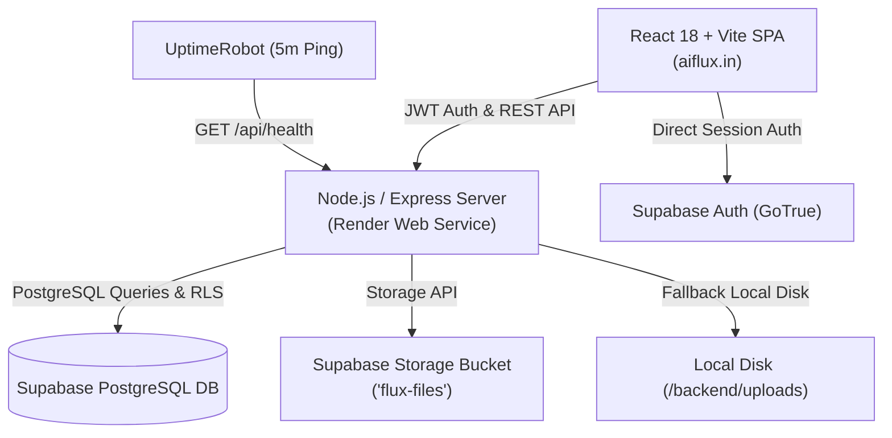

# ⚡ Flux — Personal Cloud Storage

<div align="center">


**An ultra-modern, liquid glassmorphism personal cloud storage platform with instant file streaming, hierarchical folders, and Supabase integration.**

[](https://aiflux.in)
[](./LICENSE)
[](https://react.dev/)
[](https://vitejs.dev/)
[](https://nodejs.org/)
[](https://supabase.com/)
[](https://aiflux.in)

[🌐 View Live App (aiflux.in)](https://aiflux.in) · [Report Bug](https://github.com/immayur01/aiflux/issues) · [Request Feature](https://github.com/immayur01/aiflux/issues)

</div>

---

## ✨ Features

- 💎 **3D Liquid Glassmorphism Interface** — Translucent frosted glass surfaces, glowing borders, smooth hover micro-animations, and dynamic visual depth.
- 📁 **Hierarchical Folder Architecture** — Organize files seamlessly across unlimited nested folder structures with real-time breadcrumbs.
- ⚡ **Universal File Upload & Storage** — Multi-file drag-and-drop upload with progress indicators, dual-engine storage (Supabase S3-compatible cloud bucket with automatic local disk fallback).
- 👁️ **Instant In-Browser Previews** — Stream videos, listen to audio files, view high-res images, read PDFs, and inspect code/text files directly in the browser without downloading.
- 🔐 **Secure Supabase Authentication** — JWT session management via Supabase GoTrue, encrypted passwords, Row Level Security (RLS) policies, and owner access gating.
- 🔍 **Real-Time Global Search** — Instant filtering across all filenames, extensions, and folder paths with zero latency.
- 🛡️ **Zero Data Lock-In** — 1-click downloads, secure direct file URLs, and granular folder management.
- 🌐 **24/7 Always-On Production Setup** — Live on custom domain `https://aiflux.in`, automated Let's Encrypt SSL, and keep-alive health endpoints configured with UptimeRobot.

---

## 🛠️ Architecture & Tech Stack



| Layer | Technologies Used |
|---|---|
| **Frontend** | React 18, Vite, Lucide Icons, Canvas Confetti, Vanilla CSS Glassmorphism |
| **Backend** | Node.js, Express, Multer, `@supabase/supabase-js`, CORS, Dotenv |
| **Database** | Supabase PostgreSQL, Row Level Security (RLS), relational cascades |
| **Storage Engine** | Supabase Storage (`flux-files` bucket) with local file system fallback |
| **Hosting & DNS** | Render Web Service, Hostinger DNS (`aiflux.in`), UptimeRobot Monitor |

---

## 📁 Project Directory Structure

```text
flux/
├── backend/
│   ├── src/
│   │   ├── controllers/      # Business logic (files, folders, settings, stats)
│   │   ├── middleware/       # JWT authentication & Multer upload handlers
│   │   ├── routes/           # API endpoints (/api/auth, /api/files, /api/folders, etc.)
│   │   └── server.js         # Express app entry & static SPA serving
│   ├── .env.example          # Backend environment template
│   └── package.json
├── frontend/
│   ├── public/               # Static assets & favicon
│   ├── src/
│   │   ├── components/       # Glassmorphism UI components (DropZone, Modals, Navbar)
│   │   ├── views/            # Dashboard, FolderView, SettingsView, LoginView
│   │   ├── supabase.js       # Supabase client initialization
│   │   ├── App.jsx           # Main router & state manager
│   │   └── index.css         # Custom liquid glassmorphism design system
│   ├── .env.example          # Frontend environment template
│   ├── vite.config.js
│   └── package.json
├── supabase_schema.sql       # 1-click database schema & RLS setup
├── render.yaml               # Infrastructure-as-code for Render deployment
├── LICENSE                   # MIT License
└── package.json              # Root orchestration scripts
```

---

## 🚀 Quickstart & Local Setup

### 1. Clone the Repository
```bash
git clone https://github.com/immayur01/aiflux.git
cd aiflux
```

### 2. Install Dependencies
```bash
# Install root, backend, and frontend dependencies
npm install
cd backend && npm install
cd ../frontend && npm install
cd ..
```

### 3. Configure Supabase

1. Create a free account at [Supabase](https://supabase.com/).
2. Create a new project named **flux**.
3. Open the **SQL Editor** in your Supabase dashboard, paste the contents of [`supabase_schema.sql`](./supabase_schema.sql), and click **Run**.
4. In **Storage**, create a new bucket named `flux-files` (set to public or private).
5. In **Authentication** &rarr; **Users**, click **Add user** &rarr; **Create user** (enable *Auto Confirm User*).

### 4. Setup Environment Variables

**Backend (`backend/.env`):**
```env
PORT=5000
NODE_ENV=development
SUPABASE_URL=https://your-project.supabase.co
SUPABASE_ANON_KEY=your-supabase-anon-key
SUPABASE_SERVICE_ROLE_KEY=your-supabase-service-role-key
```

**Frontend (`frontend/.env`):**
```env
VITE_SUPABASE_URL=https://your-project.supabase.co
VITE_SUPABASE_ANON_KEY=your-supabase-anon-key
```

### 5. Run in Development Mode
```bash
npm run dev
```
- Frontend: `http://localhost:5173` (Hot Module Replacement)
- Backend API: `http://localhost:5000`

---

## 🚢 Production Deployment

### Option A: Render (Zero Cost Cloud)
1. Fork or push this repository to GitHub.
2. Sign in to [Render](https://render.com) and click **New +** &rarr; **Web Service**.
3. Connect your repository and configure:
   - **Environment**: `Node`
   - **Build Command**: `npm run build`
   - **Start Command**: `npm start`
4. Add your Supabase environment variables in the **Environment** tab.
5. Click **Create Web Service**.

### Option B: Custom Domain & Always-On Setup
1. **Custom Domain**: In Render &rarr; **Settings** &rarr; **Custom Domains**, add your domain (e.g. `aiflux.in` and `www.aiflux.in`).
2. **DNS Records (Hostinger / Cloudflare / GoDaddy)**:
   - `A` Record: Host `@` &rarr; Points to Render IP (`216.24.57.1`)
   - `CNAME` Record: Host `www` &rarr; Points to your render URL (`your-app.onrender.com`)
3. **Prevent Cold Starts (24/7 Uptime)**:
   - Go to [UptimeRobot](https://uptimerobot.com) and create an **HTTP(s)** monitor.
   - Monitor URL: `https://your-domain.com/api/health`
   - Monitoring Interval: `Every 5 minutes`

---

## 📜 API Overview

| Method | Endpoint | Description |
|---|---|---|
| `GET` | `/api/health` | Service health check and uptime monitor ping |
| `POST` | `/api/auth/login` | Authenticate user credentials & issue session |
| `GET` | `/api/auth/status` | Verify active session & retrieve public config |
| `GET` | `/api/files` | Fetch all uploaded files across directories |
| `POST` | `/api/files/upload` | Upload single or batch files with metadata |
| `DELETE` | `/api/files/:id` | Permanently delete file from DB and bucket |
| `GET` | `/api/folders` | List folder tree hierarchy |
| `POST` | `/api/folders` | Create a new nested folder |
| `DELETE` | `/api/folders/:id` | Recursively delete folder and nested contents |
| `GET` | `/api/stats` | Retrieve storage space, file count, and folder metrics |

---

## 📄 License

This project is open-source and licensed under the [MIT License](./LICENSE).

---

<div align="center">
Crafted with ❤️ by <a href="https://github.com/immayur01">Mayur Sewatkar</a>
</div>
